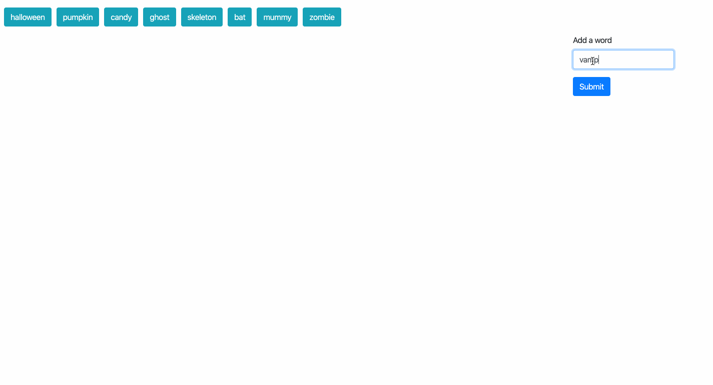
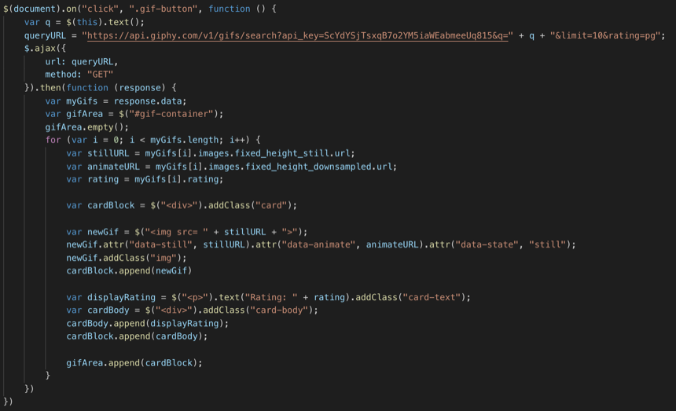
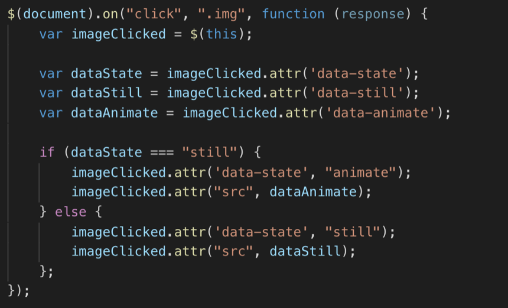

# GifTastic

A dynamic web page that populates with gifs from GIPHY. When the user clicks on a GIF button, the page grabs 10 static gif images from the GIPHY API and place them on the page. When the user clicks one of the still GIPHY images, the gif should animate. If the user clicks the gif again, it should stop playing. The user can also generate new GIF buttons by entering a new keyword in the input field.

## Technologies used

* GIPHY API
* JQuery
* JavaScript
* HTML5
* CSS
* Bootstrap

## GIF Walkthrough

## Essential Code

Logic to do an API request using AJAX and process the response:

Logic to make animate or stop playing the gif upon clicking the image:

